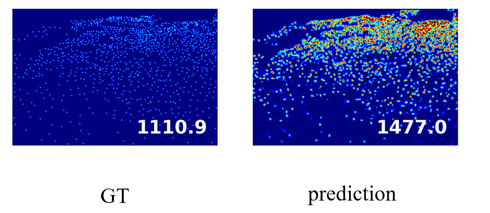
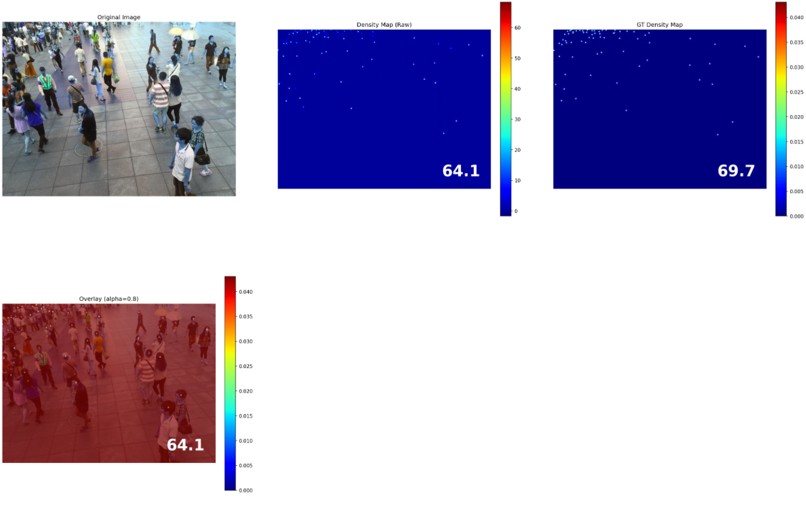
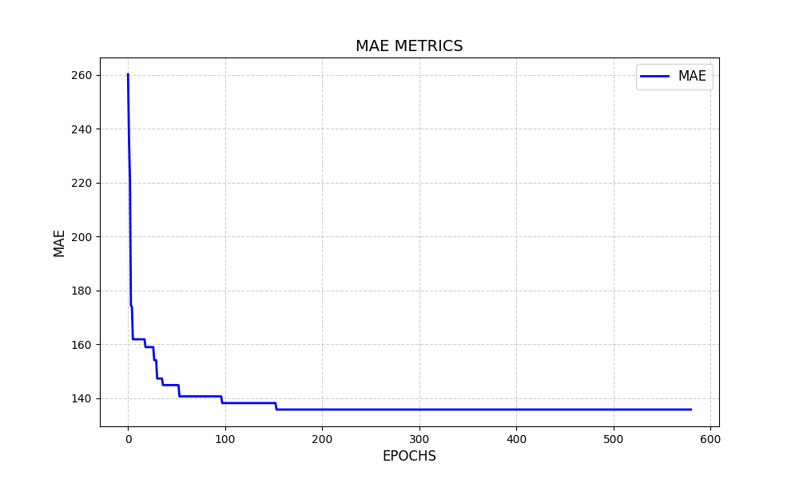

本项目主要是实现了一个人群计数框架，学习者可以直接一键使用该框架生成密度图数据集，并且该框架也给出了一些常见的损失函数实现，只需要直接加入即可使用。该框架最大的亮点是，学习者不需要去改变任何代码即可训练模型，如果学习者想要加入自己的模型，直接实现即可嵌入到该训练框架中。该框架帮助学习者不需要去关注除了核心部分之外的其他代码，帮助学习者更专心的相关算法。
并且还实现了采用分布式框架训练模型。其中有关该项目参考的其他开源代码已经在项目末尾给出了链接。
[英文文档](./README)

Github: [https://github.com/KeepTryingTo](https://github.com/KeepTryingTo)

Bilibili: [https://space.bilibili.com/625095571?spm_id_from=333.1007.0.0](https://space.bilibili.com/625095571?spm_id_from=333.1007.0.0)

CSDN: [https://blog.csdn.net/Keep_Trying_Go?type=blog](https://blog.csdn.net/Keep_Trying_Go?type=blog)

DouYin: [https://www.douyin.com/user/self](https://www.douyin.com/user/self)

### 支持的功能

[√] 单GPU，CPU或者多GPU分布式训练

[√] 自定义标注框数据集生成密度图

[√] 一键生成常见数据集的密度图之后即可进行训练，比如ShangHai_partA, ShangHai_partB,NWPU,QNRF,UCF_CC_50,JHUC-CROWD++

[√] 提供了常用的默认backbone网络模型

[√] 提供了常用的损失函数

[√] 日志记录以及模型保存（保存最好结果模型）

[√] 模型参数量以及flops统计

[√] 绘制结果MAE训练曲线

[√] 可视化真实的密度图npy以及可视化模型预测密度图

[√] 提供了常用的学习率调度器

[√] 统计GPU的使用情况

### 项目框架
```angular2html
.
├── ./CLIP
│   ├── ./CLIP/clip
│   ├── ./CLIP/CLIP.png
│   ├── ./CLIP/data
│   ├── ./CLIP/demo.py
│   ├── ./CLIP/hubconf.py
│   ├── ./CLIP/images
│   ├── ./CLIP/model-card.md
│   ├── ./CLIP/notebooks
│   ├── ./CLIP/README.md
│   ├── ./CLIP/requirements.txt
│   ├── ./CLIP/setup.py
│   └── ./CLIP/tests
├── ./configs
│   ├── ./configs/config_lr.py
│   └── ./configs/config.py
├── ./datasets
│   ├── ./datasets/copy.py
│   ├── ./datasets/crop_images.py
│   ├── ./datasets/dataset
│   ├── ./datasets/dmap_process
│   ├── ./datasets/__init__.py
│   ├── ./datasets/jhu_crowd_v2.0
│   ├── ./datasets/process_data
│   ├── ./datasets/__pycache__
│   ├── ./datasets/rename.py
│   ├── ./datasets/unit_process_data.py
│   └── ./datasets/utils
├── ./losses
│   ├── ./losses/bregman_pytorch.py
│   ├── ./losses/mae_loss.py
│   ├── ./losses/mae.py
│   ├── ./losses/MMD.py
│   ├── ./losses/mse_loss.py
│   ├── ./losses/mse.py
│   ├── ./losses/ot_loss.py
│   ├── ./losses/pytorch_ssim
│   ├── ./losses/ssim_loss.py
│   └── ./losses/transforms.py
├── ./main.py
├── ./main_ucf_cc_50.py
├── ./models
│   ├── ./models/backbones
│   ├── ./models/crowd_convnext.py
│   ├── ./models/crowd_efficientnetvx.py
│   ├── ./models/crowd_mobilenetv1.py
│   ├── ./models/crowd_mobilenetv2.py
│   ├── ./models/crowd_mobilenetv3.py
│   ├── ./models/crowd_resnet_pretrained.py
│   ├── ./models/crowd_resnet.py
│   ├── ./models/crowd_shufflenetv2.py
│   ├── ./models/crowd_vgg.py
│   ├── ./models/heads
│   ├── ./models/load_model.py
│   └── ./models/utils
├── ./plot.py
├── ./README.md
├── ./structure.txt
├── ./test.py
├── ./trainer.py
├── ./utils
│   ├── ./utils/distributed.py
│   ├── ./utils/evaluator.py
│   ├── ./utils/flops.py
│   ├── ./utils/gpu_usage.py
│   ├── ./utils/lr_schedular.py
│   ├── ./utils/save_checkpoint.py
│   ├── ./utils/select_devices.py
│   ├── ./utils/sliding_window.py
│   └── ./utils/util.py
├── ./visDemo.py
├── ./vis_gt.py
└── ./weights
```

### 环境配置
其实这里的torch和torchvision的版本没有一个强制的
要求，因为里面没有使用很特殊的库之类的。
```doctest
torch                     1.11.0+cu115
torchmetrics              1.5.2
torchtext                 0.12.0
torchvision               0.12.0+cu115
```


### 一键处理数据集
```angular2html
cd datasets
```
说明：这里的一键生成数据集是只需要指定下载数据集的根目录和保存数据集的根目录就可以了，
注意指定数据集的名称，所有生成的数据集保存目录都可以是相同的。比如我指定的保存目录
**./process_data**，然后指定保存根目录下生成的数据集结构如下：
```doctest
.
├── jhu
│   ├── test
│   │   ├── imgs
│   │   └── npys
│   ├── train
│   │   ├── imgs
│   │   └── npys
│   └── val
│       └── npys
├── nwpu
│   ├── test
│   │   └── imgs
│   ├── train
│   │   ├── imgs
│   │   └── npys
│   └── val
│       ├── imgs
│       └── npys
├── qnrf
│   ├── test
│   │   ├── imgs
│   │   └── npys
│   └── train
│       ├── imgs
│       └── npys
├── sha
│   ├── test
│   │   ├── imgs
│   │   └── npys
│   └── train
│       ├── imgs
│       └── npys
├── shb
│   ├── test
│   │   ├── imgs
│   │   └── npys
│   └── train
│       ├── imgs
│       └── npys
└── ucf_cc_50
    ├── imgs
    └── npys
```

```doctest
# unit_process_data.py
managerDataset = ManagerDataset(
        dataset_name='jhu',
        root_dir=r'数据集路径',
        save_dir=r'处理之后数据集保存路径'
    )

managerDataset()
```
### 自定义标注框数据集生成密度图
```doctest
# 进入目录
cd datasets
# 生成自定义坐标框数据集的密度图
custom_data_generate_npy.py

# 在custom_data_generate_npy.py中需要指定以下目录
# 给定图像的根目录以及box坐标框的目录
img_root = r'./dataset/data02/test/images'
label_root = r'./dataset/data02/test/labels'

# 保存图像和密度图的目录
save_dir = r'./datasets/peppers/test'
```
说明：进入**custom_data_generate_npy.py**之后，可以指定坐标框支持的数据格式，比如
**[x1, y1, x2, y2]** 或者 **[center_x, center_y, width, height]**;同时也可
以指定坐标框的值是否进行了归一化操作，比如下面的值就是进行了归一化（相对坐标大小），通过
乘以原图的高宽还原为相对原图大小的坐标。
```doctest
"""
'./dataset/data02/test/labels/1000.txt'中包含的内容格式如下: [x1, y1, x2, y2]
0.004263484453315814 0.2570867056798453 0.3127755427706069 0.5225552645596591
0.3522711649197723 0.007105183521103778 0.621207290554639 0.22462686866220802
0.7087478795653791 0.6014062643853904 0.9993402390252977 0.8706049549860585
0.3778102708899457 0.2049072599571562 0.7409225685009058 0.4753022884278988
0.16197438368392533 0.6013358787254051 0.4457309951940185 0.8692702990188341
0.5841927538253753 0.30822610052346383 0.8606768305997671 0.5426243740300136
......
"""
```


说明：在模型的训练，测试以及可视化相关位配置信息都可以进入到
**./configs/config.py**中进行配置。**PyCharm**中可以直接右击
即可进行训练/测试/可视化；也可以进入终端进行模型的**训练/测试/可视化**
**python main.py / test.py / visDemo.py**
### 模型训练
```doctest
# 相关参数配置进入进入configs/config.py进行配置
python main.py
```

### 模型测试
```doctest
# 相关参数可以进入test.py中进行设置
python test.py
```

### 图像测试可视化

```doctest
# visDemo主要是用于可视化预测结果，相关参数可以进入visDemo.py中进行设置
python visDemo.py

# vis_gt 主要是用于可视化真实标签.npy文件
vis_Gt(
    npy_path_root, 
    save_dir
)
```

说明:vis_img_den.py可视化主要是使用matplotlib对其原图，真实密度图，预测密度图
以及真实密度图和预测密度图的叠加结果进行了可视化。其中vis_img_den.py中
divided_image_patch函数需要好好理解一下，为了保证划分之后的原图经过模型分块预测
并将分块预测的结果拼接和原图大小相同，整个划分过程都需要保存划分时的索引，以便于后面
拼接至原图大小，最后的原图和预测密度图才能正常叠加。
```doctest
# vis_img_den.py

img_root = r'/home/ff/myProject/KGT/myProjects/myDataset/shanghai/ShanghaiTech/part_A/DCCUS_final/test_data/imgs'
npy_root = r'/home/ff/myProject/KGT/myProjects/myDataset/shanghai/ShanghaiTech/part_A/DCCUS_final/test_data/npys'
save_dir = r'/home/ff/myProject/KGT/myProjects/myProjects/CrowdCLIP/myGLPro/datasets/shb/vis'

from datasets.utils import transforms as T
args = get_parser()
device = 'cpu' if torch.cuda.is_available() else 'cpu'

model, optim, start_epoch, best_mae, best_mse = create_model(args, device=device)
model.eval()

normalizer = T.standard_transforms.Normalize(
    mean=[0.485, 0.456, 0.406],
    std=[0.229, 0.224, 0.225]
)
img_transformer = T.standard_transforms.Compose([
    T.standard_transforms.ToTensor(),
    normalizer
])
    
main(img_root, npy_root, save_dir)
```



### 绘制MAE和MSE曲线
说明：这个**plot.py**函数主要是用于绘制模型训练过程中验证保存的**MAE**指标,该函数的参数是
**mae_mse.txt**的路径列表和标签列表，这个标签列表表示指定绘制**MAE**的图例名称。比如下面
绘制结果:

```doctest
# plot.py函数
plot_mae(
    paths=[r'./weights/logs/sha/s_512_t_2048_2025-11-21_21-21-46/mae_mse.txt'],
    labels=['MAE']
)
```

### 参考链接
[https://github.com/cvlab-stonybrook/DM-Count]()

[https://github.com/gjy3035/Awesome-Crowd-Counting]()

[https://github.com/gjy3035/C-3-Framework]()

[https://github.com/ZPDu/Domain-general-Crowd-Counting-in-Unseen-Scenarios]()

[https://github.com/openai/CLIP]()

[https://mydreamambitious.blog.csdn.net/article/details/142730047?spm=1011.2415.3001.5331]()

[https://mydreamambitious.blog.csdn.net/article/details/147144537?spm=1011.2415.3001.5331]()

[https://mydreamambitious.blog.csdn.net/article/details/143133438?spm=1011.2415.3001.5331]()

[https://mydreamambitious.blog.csdn.net/article/details/143219789?spm=1011.2415.3001.5331]()

[https://mydreamambitious.blog.csdn.net/article/details/144692297?spm=1011.2415.3001.5331]()

[https://github.com/erdongsanshi/FFNet]()

[https://mydreamambitious.blog.csdn.net/article/details/141355068?spm=1011.2415.3001.5331]()

[https://github.com/KeepTryingTo/PyTorch-DeepLearning-Visual-LLM]()

[https://github.com/KeepTryingTo]()

[https://blog.csdn.net/Keep_Trying_Go/article/details/154913403]()

[https://mydreamambitious.blog.csdn.net/article/details/154789450?spm=1011.2415.3001.5331]()

[https://mydreamambitious.blog.csdn.net/article/details/154443638?spm=1011.2415.3001.5331]()

[https://mydreamambitious.blog.csdn.net/article/details/148124251?spm=1011.2415.3001.5331]()

[https://mydreamambitious.blog.csdn.net/article/details/148300284?spm=1011.2415.3001.5331]()

[https://mydreamambitious.blog.csdn.net/article/details/148227727?spm=1011.2415.3001.5331]()

[https://mydreamambitious.blog.csdn.net/article/details/147873916?spm=1011.2415.3001.5331]()

[https://mydreamambitious.blog.csdn.net/article/details/147851355?spm=1011.2415.3001.5331]()

[https://mydreamambitious.blog.csdn.net/article/details/147819012?spm=1011.2415.3001.5331]()

[]()

[]()

[]()


